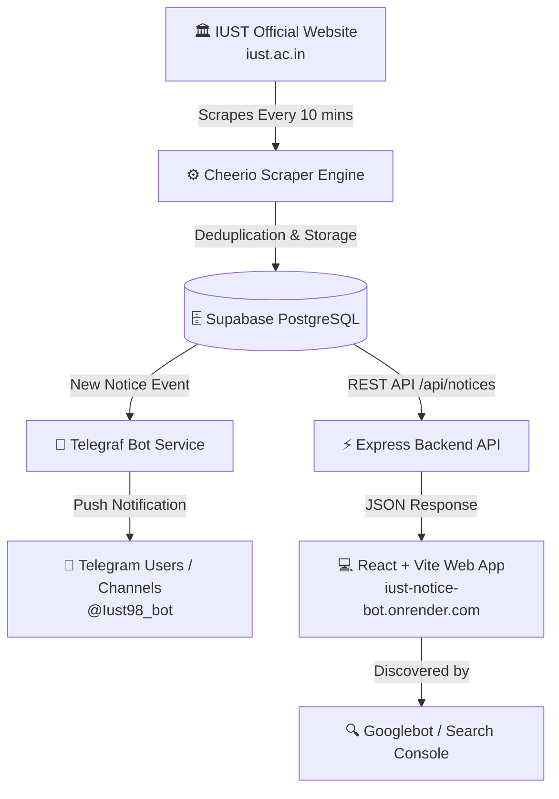

# 📢 IUST Notice Bot

<div align="center">

[](https://iust-notice-bot.onrender.com)
[](https://t.me/Iust98_bot)
[](https://search.google.com)
[](LICENSE)

<p align="center">
  <strong>Real-time notice tracker & notification aggregator for Islamic University of Science & Technology (IUST), Kashmir.</strong>
</p>

[🌐 Live Web App](https://iust-notice-bot.onrender.com) • [🤖 Telegram Bot](https://t.me/Iust98_bot) • [🏛️ Official University Site](https://iust.ac.in) • [✨ Report an Issue](https://github.com/Champsg/iustbot/issues)

</div>

---

## 📖 Overview

**IUST Notice Bot** is an automated web scraping, indexing, and instant notification service engineered for students, researchers, and faculty members at the **Islamic University of Science & Technology (IUST), Awantipora, Kashmir**.

The system monitors official university updates from `iust.ac.in` 24/7, detects new examination circulars, date sheets, admission alerts, result declarations, and administrative notices, and instantly broadcasts them straight to users via **Telegram** and the **Live Web Dashboard**.

---

## ✨ Features

- ⚡ **Real-Time Automated Scraping**: Background cron jobs scrape official IUST notices periodically with deduplication against Supabase database.
- 📲 **Instant Telegram Broadcasts**: Subscribers to [`@Iust98_bot`](https://t.me/Iust98_bot) receive instant push alerts with title, publication date, category, and direct document links.
- 💻 **Live Responsive Web Dashboard**: Fast, modern web interface built with React, Framer Motion, and Lucide icons.
- 🔍 **Instant Search & Filter**: Real-time client-side search across notices, date sheets, and result circulars.
- 🚀 **SEO & Rich Snippets Ready**: Fully optimized for Google Search ranking with JSON-LD Schema (`WebApplication`, `WebSite`, `FAQPage`), OpenGraph tags, Geo-tagging for Kashmir/India, and custom XML sitemaps.
- 🛡️ **Reliable & Self-Healing**: Includes automatic pinging to prevent Render cold starts and administrative alert channels for error monitoring.

---

## 🏗️ Architecture & Data Flow



---

## 🛠️ Tech Stack

| Layer | Technology |
|---|---|
| **Frontend** | React 19, Vite, Framer Motion, Lucide Icons, CSS Modules / Glassmorphism |
| **Backend API** | Node.js, Express 5, CORS, Node-Cron, Axios |
| **Web Scraping** | Cheerio, Axios |
| **Database** | Supabase (PostgreSQL) |
| **Notification Services** | Telegraf (Telegram Bot API), Firebase Cloud Messaging (FCM) |
| **Hosting & CI/CD** | Render (Web Service), GitHub |
| **Search Optimization** | Google Search Console, Schema.org JSON-LD (FAQPage, WebApp), XML Sitemap |

---

## 🚀 Getting Started

### Prerequisites

- [Node.js](https://nodejs.org/) (v18 or higher recommended)
- [npm](https://www.npmjs.com/)
- A [Supabase](https://supabase.com) project
- A [Telegram Bot Token](https://t.me/BotFather) from BotFather

### Installation

1. **Clone the repository**:
   ```bash
   git clone https://github.com/Champsg/iustbot.git
   cd iustbot
   ```

2. **Install dependencies**:
   ```bash
   npm install
   ```

3. **Configure Environment Variables**:
   Create a `.env` file in the root directory:
   ```env
   # Supabase Configuration
   VITE_SUPABASE_URL=your_supabase_project_url
   VITE_SUPABASE_ANON_KEY=your_supabase_anon_key

   # Telegram Bot Configuration
   TELEGRAM_BOT_TOKEN=your_telegram_bot_token
   ADMIN_CHAT_ID=your_telegram_admin_chat_id

   # Server Port
   PORT=3001
   RENDER_EXTERNAL_URL=https://iust-notice-bot.onrender.com
   ```

4. **Run Development Server**:
   ```bash
   # Run both React frontend and Express/Bot backend concurrently
   npm run dev:all
   ```

5. **Build for Production**:
   ```bash
   npm run build
   ```

---

## 📡 API Endpoints

| Method | Endpoint | Description |
|---|---|---|
| `GET` | `/api/notices` | Fetches the latest 20 university notices from the database |
| `GET` | `/api/status` | Returns the timestamp of the last successful scrape cycle |
| `GET` | `/api/ping` | Keep-alive heartbeat endpoint for uptime monitors |
| `GET` | `/api/test-notify` | Triggers a test notification across Telegram and FCM channels |

---

## 🔍 SEO & Google Search Console Verification

- **Live URL**: [https://iust-notice-bot.onrender.com/](https://iust-notice-bot.onrender.com/)
- **Sitemap**: [https://iust-notice-bot.onrender.com/sitemap.xml](https://iust-notice-bot.onrender.com/sitemap.xml)
- **Robots.txt**: [https://iust-notice-bot.onrender.com/robots.txt](https://iust-notice-bot.onrender.com/robots.txt)
- **Search Verification**: Site ownership verified on Google Search Console via HTML file / meta tags with active structured schema markup (`FAQPage`, `WebApplication`, `WebSite`).

---

## 🤝 Contributing

Contributions, issues, and feature requests are welcome!

1. Fork the Project
2. Create your Feature Branch (`git checkout -b feature/AmazingFeature`)
3. Commit your Changes (`git commit -m 'Add some AmazingFeature'`)
4. Push to the Branch (`git push origin feature/AmazingFeature`)
5. Open a Pull Request

---

## 📄 License

Distributed under the MIT License.

<div align="center">
  <sub>Built with ❤️ for the students and community of Islamic University of Science & Technology (IUST), Kashmir.</sub>
</div>
